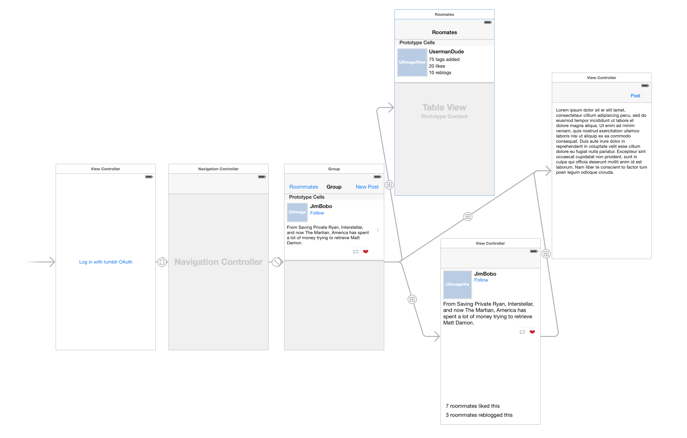

## What do
Roomblr allows tumblr users to join a group that populates a post feed by aggregating tags from everyone's liked posts. A user just needs to log in, and immediately they will start seeing posts based on tags from posts they've liked, but also posts people in the group have liked. The group is maintained in Parse. Users may also follow other tumblr users, like posts, reblog posts, or create a new post and share it with the room. Newer versions may also allow black/whitelisting tags from the group feed.

## User Stories

- This is a basic visual guide for what the app should sorta look like. It will be similar to the twitter client and Instagram apps .
- A user needs to login with Tumblr OAuth. When a user logs in we will make an API request for their likes.
- Then we can use the tags as the searchTerms to use in the mobile/search endpoint. 
- When we get data back we need to filter down to posts that are of type text. (we can probably make a bonus for other types)
- We should have all data needed for the user status on that post (has the user liked/reblogged already, but it shouldn't be)
- Finally we put the post on the tableView and save to Parse.

- The rest of the screens are basically the same as the twitter client (login, new post, and post detail).

- Because we dont have a sophisticated server we have to handle stuff on the client (the fetching of likes and piping it to search).
- When another user logs in they will see all the posts already :) .
- Data is pulled from Parse and shown when you navigate to the tableView. 
- We can store teh currentUser on the app.

